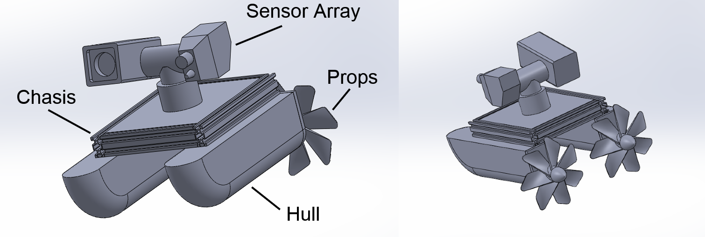

## Overview
### **In a basic paragraph, what is the goal for our exploration device?** 

We will build an exploration rover that will be used for exploring environments typically recognized as dangerous for humans. The rover will explore water and/or land based environments and have a chassis with multiple motors to act as actuators for moving a basic chassis around the environment. The human-machine interface will act as a central controller for the chassis and modular subsystems which can be swapped out to meet parameters for missions of different natures.

### **In a basic paragraph, who is our audience?**

Our audience are the corporations who use expendable drones/rovers in potentially hostile and unsafe environments. These groups will not be limited to missions of a single unique nature, but rather missions whose parameters can change significantly.

## 100 Features, grouped but unranked
| **Feature** | **Catagory** |
| :------- | :----------------------------- |
|Atmospheric monitoring|Exploration| 
|Ultrasonic speaker and microphone to map surfaces and walls|Exploration| 
|Path finding|Exploration| 
|Obstacle-detection sensors with autonomous avoidance|Exploration| 
|WiFi-based positioning and geolocation|Exploration| 
|Traction and stability control with per-wheel power modulation|Exploration| 
|Location recognition using preloaded map/media data without GPS|Exploration| 
|Visual inspection (thermal/corona/visible)|Exploration| 
|Grappling-hook mechanism for climbing steep inclines|Exploration| 
|Vacuum adhesion for walls and ceilings|Exploration| 
|Adjustable wheelbase width for narrow or spread surfaces|Exploration| 
|QR-code-based navigation and positioning|Exploration| 
|Screw-based locomotion for all-terrain movement|Exploration| 
|Camera to record images around the rover|User interface and interaction| 
|GPS to show the rover’s location|User interface and interaction| 
|Display to show camera images|User interface and interaction| 
|display to show where the rover has moved|User interface and interaction| 
|Program to return rover to origin if connection is lost|User interface and interaction| 
|Mobile radio relay rover for operator location obfuscation|User interface and interaction| 
|Black box data recovery system|User interface and interaction| 
|Guitar Hero controller (robot interface or input concept)|User interface and interaction| 
|System to remove and replace simple modules (CD-player style)|Modular ability| 
|Bucket to carry objects or modular components|Modular ability| 
|Firefighting module (CO₂ spray)|Types of modules| 
|Antenna to receive signals from a remote|Types of modules| 
|Spray actuator|Types of modules| 
|LiDAR scanning|Types of modules| 
|Spray turret for garden watering using yaw and water pressure|Types of modules| 
|Interior mapping|Types of modules| 
|Remote-controlled clamp to grab objects above the rover|Types of modules| 
|Modular grasping arms|Types of modules| 
|Shaft mechanism to push device upright if it flips|Types of modules| 
|Remote Speaker|Types of modules| 
|Motor-driven jacks for braking and lifting|Types of modules| 
|SCARA manipulator module|Types of modules| 
|Heat signature module|Types of modules| 
|Wall-contact sensor|Types of modules| 
|Camera and automatic rebar-tying module|Types of modules| 
|Energy-saving hibernation mode|Types of modules| 
|Integrated cutting or sawing tool for obstacle removal|Types of modules| 
|Atmospheric monitoring|Types of modules| 
|Thermite or hazardous-material laying module|Types of modules| 
|Barometer to show incline/decline changes|Types of modules| 
|Regenerative braking system|Types of modules| 
|Speaker/microphone module|Types of modules| 
|Small microphone that beeps when near an object|Types of modules| 
|Motion detector to recognize movement if camera misses it|Types of modules| 
|Position/leveling system|Types of modules| 
|Solid/liquid scoop or vacuum collection module|Types of modules| 
|Concrete or viscous fluid laying module|Types of modules| 
|Heavy roller to pave paths and flatten ground|Types of modules| 
|Humidity and weather measurement system|Types of modules| 
|Brush scrubber|Types of modules| 
|Heater module (melting snow, ice, frozen pipes)|Types of modules| 
|Gyroscopic self-leveling system|Types of modules| 
|Deployable GPS beacon system|Types of modules| 
|Soil sample retrieval and storage mechanism|Types of modules| 
|Spring-loaded jumping mechanism|Types of modules| 
|Underwater gyroscopic stabilization|Types of modules| 
|Hybrid wheel/propeller exploration device for drive/flight modes|Types of modules| 
|WiFi handshake interception, SSID duplication, and deauth spoofer|Types of modules| 
|Firefighting robot for scouting burning buildings and rescuing victims|Specialization| 
|Post-catastrophe response|Specialization| 
|Bomb defusal and locator robot|Specialization| 
|Transport over rough or inhospitable terrain|Specialization| 
|Mountain/off-road trail explorer|Specialization| 
|Cave exploration robot measuring pressure, oxygen, and toxic gases|Specialization| 
|Electronic “seeing-eye dog” with audio/tactile feedback|Specialization| 
|Power utility predictive maintenance|Specialization| 
|Power-line climbing repair robot|Specialization| 
|Hostage search-and-rescue drone|Specialization| 
|Nuclear fallout mapping drone|Specialization| 
|Volcanic tunnel mapping rover|Specialization| 
|Off-road vehicle recovery robot|Specialization| 
|Arctic mapping rover|Specialization| 
|Surface reconnaissance vehicle|Specialization| 
|Explosive minefield survey drone|Specialization| 
|Underwater welding drone|Specialization| 
|Autonomous buoy with ballast tanks for marine migration monitoring|Specialization| 
|Minefield clearing robot|Specialization| 
|Mineral identifier and mining robot|Specialization| 
|Octopus-inspired exploration robot with distributed limb intelligence|Specialization| 
|Cargo ship crate cleaner and upkeep drone|Specialization| 
|Cleaning robot|Specialization| 
|Riot drone|Specialization| 
|Mars rover|Specialization| 
|High-speed camouflaged wildlife monitoring rover|Specialization| 
|Solar panel cleaning|Specialization| 
|Space exploration impactor or skycrane delivery probe|Specialization| 
|Deep-sea exploration submarine|Specialization| 
|Eco-friendly coral reef surveyor and monitor|Specialization| 
|Drone-carrier rover acting as a mobile mothership|Specialization| 
|Wildlife parasite remover drone|Specialization| 
|Underwater barnacle remover drone|Specialization| 
|Very small, discreet exploration device|Specialization| 
|Fishfinder robot using surface navigation and underwater radar|Specialization| 
|Rooftop and gutter cleaning robot|Specialization| 
|Remote animal entertainment|Specialization| 
|Investigative surgical robot|Specialization| 
|Low-profile, radar-avoiding ground design|Specialization| 
|Microscopic bacterial observer|Specialization| 
|Symmetrical robot with tank treads that functions upside down|Specialization| 
|Network exploration rover for wireless SSID discovery|Specialization| 
|BLE “hunting dog” that tracks wireless/Bluetooth devices|Specialization|
## 100 Features in order of rank
| **Feature** | **Catagory** |
| :------- | :----------------------------- |
| Firefighting robot for scouting burning buildings and rescuing victims | Specialization |
| Bomb defusal and locator robot | Specialization |
| Hostage search-and-rescue drone | Specialization |
| Post-catastrophe response | Specialization |
| Drone-carrier rover acting as a mobile mothership | Specialization |
| Surface reconnaissance vehicle | Specialization |
| Antenna to receive signals from a remote | Types of modules |
| Camera to record images around the rover | User interface and interaction |
| Visual inspection (thermal/corona/visible) | Exploration |
| Display to show camera images | User interface and interaction |
| GPS to show the rover’s location | User interface and interaction |
| display to show where the rover has moved | User interface and interaction |
| Modular grasping arms | Types of modules |
| SCARA manipulator module | Types of modules |
| Interior mapping | Types of modules |
| LiDAR scanning | Types of modules |
| Heat signature module | Types of modules |
| Motion detector to recognize movement if camera misses it | Types of modules |
| Wall-contact sensor | Types of modules |
| Minefield clearing robot | Specialization |
| Explosive minefield survey drone | Specialization |
| Location recognition using preloaded map/media data without GPS | Exploration |
| QR-code-based navigation and positioning | Exploration |
| Deployable GPS beacon system | Types of modules |
| Path finding | Exploration |
| Obstacle-detection sensors with autonomous avoidance | Exploration |
| Program to return rover to origin if connection is lost | User interface and interaction |
| Black box data recovery system | User interface and interaction |
| Energy-saving hibernation mode | Types of modules |
| Gyroscopic self-leveling system | Types of modules |
| Position/leveling system | Types of modules |
| Shaft mechanism to push device upright if it flips | Types of modules |
| Firefighting module (CO₂ spray) | Types of modules |
| Heater module (melting snow, ice, frozen pipes) | Types of modules |
| Atmospheric monitoring | Exploration |
| Humidity and weather measurement system | Types of modules |
| Barometer to show incline/decline changes | Types of modules |
| Remote-controlled clamp to grab objects above the rover | Types of modules |
| Solid/liquid scoop or vacuum collection module | Types of modules |
| Speaker/microphone module | Types of modules |
| Remote Speaker | Types of modules |
| Traction and stability control with per-wheel power modulation | Exploration |
| Adjustable wheelbase width for narrow or spread surfaces | Exploration |
| Motor-driven jacks for braking and lifting | Types of modules |
| Regenerative braking system | Types of modules |
| Grappling-hook mechanism for climbing steep inclines | Exploration |
| Vacuum adhesion for walls and ceilings | Exploration |
| Screw-based locomotion for all-terrain movement | Exploration |
| Spring-loaded jumping mechanism | Types of modules |
| Symmetrical robot with tank treads that functions upside down | Specialization |
| Ultrasonic speaker and microphone to map surfaces and walls | Exploration |
| WiFi-based positioning and geolocation | Exploration |
| System to remove and replace simple modules (CD-player style) | Modular ability |
| Bucket to carry objects or modular components | Modular ability |
| Brush scrubber | Types of modules |
| Heavy roller to pave paths and flatten ground | Types of modules |
| Concrete or viscous fluid laying module | Types of modules |
| Spray actuator | Types of modules |
| Spray turret for garden watering using yaw and water pressure | Types of modules |
| Soil sample retrieval and storage mechanism | Types of modules |
| Mineral identifier and mining robot | Specialization |
| Fishfinder robot using surface navigation and underwater radar | Specialization |
| Eco-friendly coral reef surveyor and monitor | Specialization |
| Autonomous buoy with ballast tanks for marine migration monitoring | Specialization |
| Underwater gyroscopic stabilization | Types of modules |
| Deep-sea exploration submarine | Specialization |
| Volcanic tunnel mapping rover | Specialization |
| Cave exploration robot measuring pressure, oxygen, and toxic gases | Specialization |
| Mountain/off-road trail explorer | Specialization |
| Transport over rough or inhospitable terrain | Specialization |
| Off-road vehicle recovery robot | Specialization |
| Arctic mapping rover | Specialization |
| High-speed camouflaged wildlife monitoring rover | Specialization |
| Very small, discreet exploration device | Specialization |
| Low-profile, radar-avoiding ground design | Specialization |
| Hybrid wheel/propeller exploration device for drive/flight modes | Types of modules |
| Octopus-inspired exploration robot with distributed limb intelligence | Specialization |
| Electronic “seeing-eye dog” with audio/tactile feedback | Specialization |
| Power utility predictive maintenance | Specialization |
| Power-line climbing repair robot | Specialization |
| Solar panel cleaning | Specialization |
| Cargo ship crate cleaner and upkeep drone | Specialization |
| Rooftop and gutter cleaning robot | Specialization |
| Cleaning robot | Specialization |
| Underwater barnacle remover drone | Specialization |
| Wildlife parasite remover drone | Specialization |
| Remote animal entertainment | Specialization |
| Investigative surgical robot | Specialization |
| Microscopic bacterial observer | Specialization |
| Network exploration rover for wireless SSID discovery | Specialization |
| BLE “hunting dog” that tracks wireless/Bluetooth devices | Specialization |
| WiFi handshake interception, SSID duplication, and deauth spoofer | Types of modules |
| Thermite or hazardous-material laying module | Types of modules |
| Integrated cutting or sawing tool for obstacle removal | Types of modules |
| Riot drone | Specialization |
| Nuclear fallout mapping drone | Specialization |
| Underwater welding drone | Specialization |
| Space exploration impactor or skycrane delivery probe | Specialization |
| Mars rover | Specialization |
| Small microphone that beeps when near an object | Types of modules |
| Speaker/microphone module | Types of modules |
| Camera and automatic rebar-tying module | Types of modules |
| Atmospheric monitoring | Types of modules |
| Guitar Hero controller (robot interface or input concept) | User interface and interaction |

## Design Concepts

### Design Concept 1: Firefighter rover

Full resolution pdf: 

### Description:
This is a firefighting robot, it's purpose is to navigate into dangerous areas and provide fire suppression. The device is equipped with a swiveling nozzle, belt driven locomotion, a 360 camera for navigation, a siren, and 2 auxiliary water tanks. In addition, the electronics box mounted near the back of the rover contains several useful sensors such as temperature, smoke, remaining water pressure, and carbon monoxide. The tanks are refilled and pressurized via a firehose through a connection point in the back of the rover, the rover can also operate using water directly from the hose for an unlimited water supply.

The controller for the rover will have a screen displaying sensor data, and the camera view. The rover's movement, nozzle swivel, and dispensing can all be controlled remotely through the controller via two-way wireless communication between two esp32 boards. The display will also alert the user of dangerously high temperatures or low water pressure with visual and audio cues.

The controller setup will be two joysticks, one for steering, and one for the nozzle swivel. There will be several switches, such as an alarm toggle, nozzle toggle, and switching between internal and external water supplies. Ideally these controls will be kept simplistic to allow users to operate the device without much instruction.

Functionality will be split between 4 groups of 2. A group for designing the drive train, a group for designing the controls and communication protocol, a group for designing the main electronics box, and a group focused on the water nozzle and dispensing system.

### Applicable features (List of features used during brainstorm to create the design concept):
- Firefighting robot for scouting burning buildings and rescuing victims (Specialization)
- Firefighting module, CO₂ spray (Types of modules)
- Display to show camera images (User interface and interaction)
- Antenna to receive signals from a remote (Types of modules)
- Speaker/microphone module (Types of modules)
- Visual inspection (thermal/corona/visible) (Exploration)

### Design Concept 2: Aquatic rover

### Description:
The aquatic rover's goal is to travel across water and gather sense data from objects of interest, such as boats or marine wildlife. The device has a complex sensor array on a pivot allowing it to view many angles and gather a large sum of data. The array contains a camera, distance sensor, barometer, humidity sensor, and microphone.

The rover will be controlled by an operator either on a nearby boat, or shore depending on the environment. The controller will have a screen to display camera and sensor data, as well as a microSD card slot for storing video or sensor data. The controller will have two joysticks and several toggles, the joysticks will control the movement of the rover and the orientation of the sensor array. The several toggles will be used to enable certain data readouts on the screen, and enable data recording.

Functionality will be split between three groups. A group for designing the locomotion and main hull of the device, a group for designing the sensor array and swivel, and a group for designing the controller and communication system.

### Applicable features (List of features used during brainstorm to create the design concept):
- High-speed camouflaged wildlife monitoring rover (Specialization)
- Speaker/microphone module (Types of modules)
- Antenna to receive signals from a remote (Types of modules)
- Display to show camera images (User interface and interaction)
- LiDAR scanning (Types of modules)
- Eco-friendly coral reef surveyor and monitor (Specialization)
- Humidity and weather measurement system (Types of modules)
- Camera to record images around the rover (User interface and interaction)

### Design Concept 3: Bomb bot

### Description:
The bomb bot's task is to go into areas with some sort of explosive device, grab the device, and carry it to a location where it can be safely detonated or disarmed. The device is equipped with an articulated arm, camera, and long range antenna.

The controller for the rover will have a screen displaying the camera view, and controls for both the arm and the rover itself. The controller will contain 2 joysticks, a toggle switch, and a button. Toggling the switch will swap between rover steering controls and arm controls. Pressing the button will toggle the arms manipulator between its open and closed states. By limiting the amount of user inputs on the controller we hope the controls will be much more simplistic and straightforward to use. Audio cues will be played when the controller connects, and small LEDs will be used to indicate connectivity and power.

Functionality will be split between three groups. A group for designing the movement and chassis of the rover, a group for creating the arm and IK formulas, and a group designated to the controller, wireless communication, and camera.

### Applicable features (List of features used during brainstorm to create the design concept):
- Post-catastrophe response (Specialization)
- Bomb defusal and locator robot (Specialization)
- Transport over rough or inhospitable terrain (Specialization)
- Modular grasping arms (Types of modules)
- SCARA manipulator module (Types of modules)
- Display to show camera images (User interface and interaction)
- Antenna to receive signals from a remote (Types of modules)
- Explosive minefield survey drone (Specialization)

## Selected Design

### Selection:

### Rationale:
Our team decided to select design concept 2, The aquatic rover. This selection was made by a majority vote from our group members. Our team made this selection as we  feel that this exploration device is the most versatile, the most interesting, and the most straightforward. We believe that this design will fulfill the project requirements well, and be the ideal device for our targeted user.

