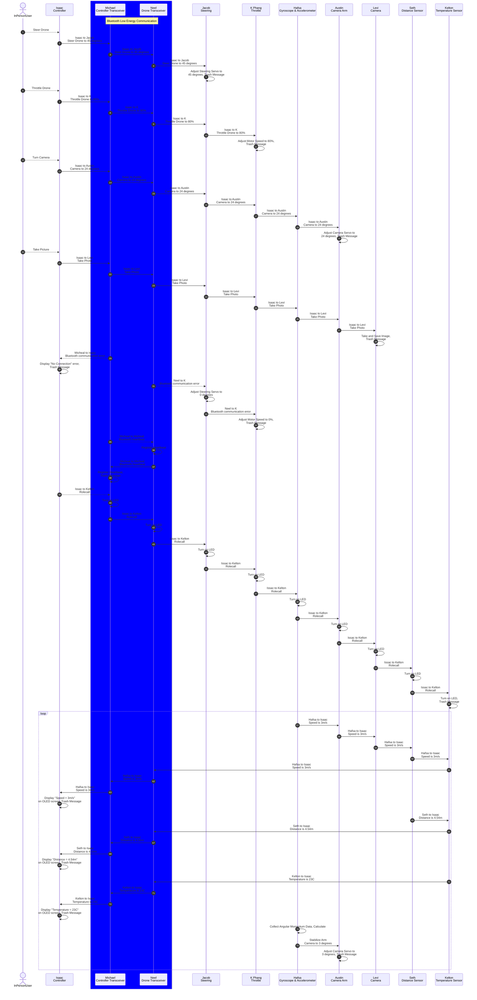

## Team Block Diagram

**Figure 1:** Block Diagram of all subsystem modules in subgroups A, B, C, D with connectors and communication chain. PDF version [*here*](files/Team201_BlockDiagram.pdf)

## Sequence Diagram of Team Communication

## Message Types
| **message type byte 1 (uint8_t)** | **description** |
| -------: | :------- |
| 1  | Set steering angle in degrees - Sent from A1 to B2 as a response to user input. Upon recieving, B2 will move the rudders to the indicated position. |
| 2  | Set steering throttle percentage - Sent from A1 to B1 as a response to user input. Upon recieving, B1 will adjust the speed of the propellers to the desired percentage. |
| 3  | Set camera angle in degrees - Sent from A1 to C2 as a response to user input. Upon recieving, C2 will move the camera gimbal to the indicated position.  |
| 4  | Take picture. Sent from A1 to C1 as a response to user input. Upon recieving, C1 will take a picture and save it to an SD card. |
| 5  | Send speed data in m/s - Sent periodically from C3 to A1. Upon recieving, A1 will update the display. |
| 6  | Send distance data in cm - Sent periodically from D2 to A1. Upon recieving, A1 will update the display. |
| 7  | Send temperature data in celsius - Sent periodically from D1 to A1. Upon recieving, A1 will update the display. |
| 8  | Send camera angle data data in degrees - Sent periodically from C3 to C2. Used for gimbal stabilization. |
| 9  | Bluetooth communication error - Sent from both A2 and A3 as a broadcast as a result of failing 3 bluetooth heartbeat checks. Upon recieving, B2 sets angle to 0, B1 sets throttle to 0, and A1 shows an error on screen. |
| 10  | Bluetooth relay data - Sent between A2 and A3 (bidirectional). Contains a relayed message and relayed sender/reciever IDs. |
| 11 | Bluetooth heartbeat - Sent periodically from A2 to A3. Upon recieving, A3 will send this message back. If neither board recieves a heartbeat within a set interval, heartbeat failure will be recorded. |
| 12 | Rollcall - Debugging broadcast message triggered by pushing the 'debug' button on any subsystems configured to do so. Not all systems are expected to be able to trigger rollcall, but all systems must respond to it. Lights up LEDs for a set interval on every subsystem that recieves it. |

## Message Types data structures

Message type 1:

||**Byte 1** |**Byte 2**|**Byte 3**|**Byte 4**|
| :-------: | :-------: | :-------: | :-------: | :-------: |
| Variable Name | Sender_ID | Reciever_ID | Message_Type | Angle |
| Variable Type | char | char | uint8_t | uint8_t |
| Min Value | A | E |1 | 0 |
| Max Value | A | E | 1| 255|
| Example | A | E |1 | 125 | 

Message type 2:

||**Byte 1** |**Byte 2**|**Byte 3**|**Byte 4**|
| :-------: | :-------: | :-------: | :-------: | :-------: |
| Variable Name | Sender_ID | Reciever_ID | Message_Type | Throttle |
| Variable Type | char | char | uint8_t | uint8_t |
| Min Value | A | D |2 | 0 |
| Max Value | A | D | 2| 255|
| Example | A | D |2 | 125 | 

Message type 3:

||**Byte 1** |**Byte 2**|**Byte 3**|**Byte 4**|**Byte 5**|
| :-------: | :-------: | :-------: | :-------: | :-------: | :-------: |
| Variable Name | Sender_ID | Reciever_ID | Message_Type | Yaw | Pitch |
| Variable Type | char | char | uint8_t | uint8_t | uint8_t |
| Min Value | A | G |5 | 0 | 0 |
| Max Value | A | G | 5| 255| 255 |
| Example | A | G |5 | 125 | 90 |

Message type 4:

||**Byte 1** |**Byte 2**|**Byte 3**|
| :-------: | :-------: | :-------: | :-------: |
| Variable Name | Sender_ID | Reciever_ID | Message_Type |
| Variable Type | char | char | uint8_t |
| Min Value | A | F |4 |
| Max Value | A | F | 4|
| Example | A | F |4 |

Message type 5:

||**Byte 1** |**Byte 2**|**Byte 3**|**Byte 4**|
| :-------: | :-------: | :-------: | :-------: | :-------: |
| Variable Name | Sender_ID | Reciever_ID | Message_Type | Speed |
| Variable Type | char | char | uint8_t | uint8_t |
| Min Value | H | A |5 | 0 |
| Max Value | H | A | 5| 255|
| Example | H | A |5 | 125 | 

Message type 6:

|**Byte 1 (uint8_t)**|**Byte 2-3 (uint16_t)**|
| ------- | ------- |
| 6 | Distance(uint16_t) |

Message type 7:

|**Byte 1 (uint8_t)**|**Byte 2 (uint8_t)**|
| ------- | ------- |
| 7 | Temperature(uint8_t) |

Message type 8:

|**Byte 1 (uint8_t)**|
| ------- |
| 8 |

Message type 9:

|**Byte 1 (uint8_t)**|**Byte 2 (uint8_t)**|**Byte 3 (uint8_t)**|**Byte 4 (uint8_t)**|**Byte 5 (uint8_t)**|
| ------- | ------- | ------- | ------- | ------- |
| 9 | Relayed sender ID(uint8_t) | Relayed reciever ID(uint8_t) | Relayed message data(uint8_t) |

Message type 10:

|**Byte 1 (uint8_t)**|
| ------- |
| 10 |

Message type 11:

|**Byte 1 (uint8_t)**|
| ------- |
| 11 |
