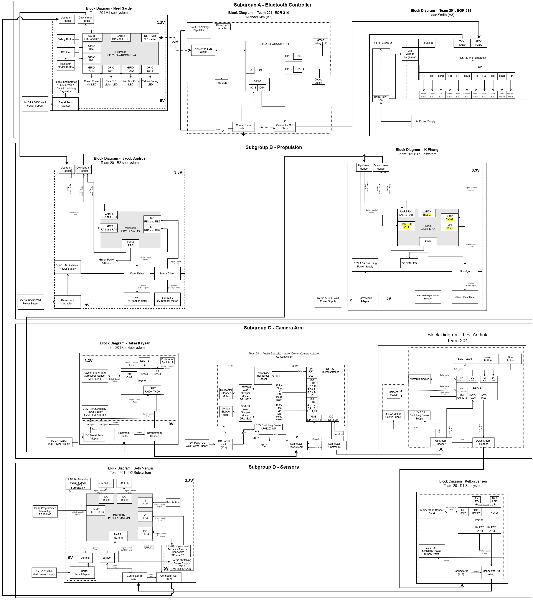
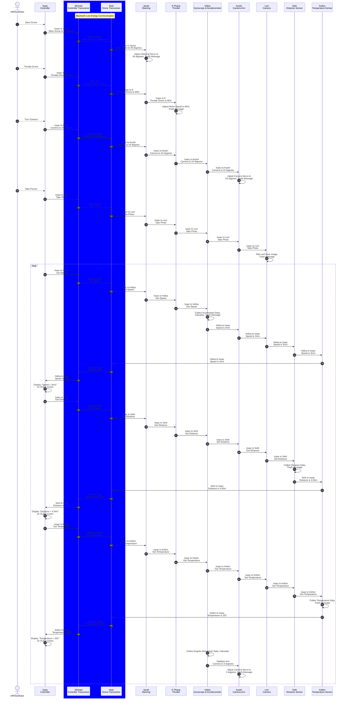

## Team Block Diagram

**Figure 1:** Block Diagram of all subsystem modules in subgroups A, B, C, D with connectors and communication chain. PDF version [*here*](files/Team201_BlockDiagram.pdf)

## Sequence Diagram of Team Communication

## Message Types
| **message type byte 1 (uint8_t)** | **description** |
| -------: | :------- |
| 1  | Set steering angle in degrees |
| 2  | Set steering throttle percentage |
| 3  | Set camera angle in degrees |
| 4  | Take picture |
| 5  | Get speed data |
| 6  | Get distance data |
| 7  | Get temperature data |
| 8  | Display speed data |
| 9  | Display distance data |
| 10 | Display temperature data |
| 11 | Adjust camera angle in degrees |

## Message Types data structures

Message type 1:

|**Byte 1 (uint8_t)**|**Byte 2 (uint8_t)**|
| ------- | ------- |
| 1 | Angle(uint8_t) |

Message type 2:

|**Byte 1 (uint8_t)**|**Byte 2 (uint8_t)**|
| ------- | ------- |
| 2 | Throttle(uint8_t) |

Message type 3:

|**Byte 1 (uint8_t)**|**Byte 2 (uint8_t)**|
| ------- | ------- |
| 3 | Angle(uint8_t) |

Message type 4:

|**Byte 1 (uint8_t)**|
| ------- |
| 4 |

Message type 5:

|**Byte 1 (uint8_t)**|
| ------- |
| 5 |

Message type 6:

|**Byte 1 (uint8_t)**|
| ------- |
| 6 |

Message type 7:

|**Byte 1 (uint8_t)**|
| ------- |
| 7 |

Message type 8:

|**Byte 1 (uint8_t)**|**Byte 2 (uint8_t)**|
| ------- | ------- |
| 8 | Speed(uint8_t) |

Message type 9:

|**Byte 1-2 (uint8_t)**|**Byte 2 (uint8_t)**|
| ------- | ------- |
| 9 | Distance(uint8_t) |

Message type 10:

|**Byte 1 (uint8_t)**|**Byte 2 (uint8_t)**|
| ------- | ------- |
| 10 | Temperature(uint8_t) |

Message type 11:

|**Byte 1 (uint8_t)**|**Byte 2 (uint8_t)**|
| ------- | ------- |
| 11 | Angle(uint8_t) |
