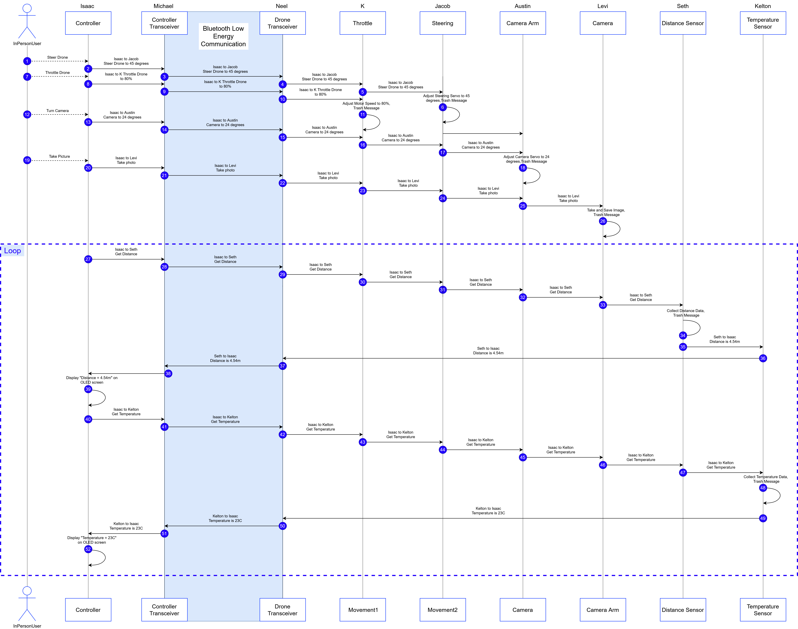

## Header
## Team Block Diagram

## Sequence Diagram of Team Communication

## Message Types
|**message type byte 1-2 (uint16_t)**|**description**|
| -------: | :------- |
| 1 | Set steering angle in degrees |
| 2 | Set steering throttle percentage |
| 3 | Set camera angle in degrees |
| 4 | Take picture |
| 5 | Get distance data |
| 6 | Get temperature data |
| 7 | Display distance data |
| 8 | Display temperature data |

## Message Types data structures

Message type 1:

|**Byte 1-2 (uint16_t)**|**Byte 3 (uint8_t)**|
| ------- | ------- |
| 1 | Angle(uint8_t) |

Message type 2:

|**Byte 1-2 (uint16_t)**|**Byte 3 (uint8_t)**|
| ------- | ------- |
| 2 | Throttle(uint8_t) |

Message type 3:

|**Byte 1-2 (uint16_t)**|**Byte 3 (uint8_t)**|
| ------- | ------- |
| 3 | Angle(uint8_t) |

Message type 4:

|**Byte 1-2 (uint16_t)**|**Byte 3 (uint8_t)**|
| ------- | ------- |
| 4 | Throttle(bool) |

Message type 5:

|**Byte 1-2 (uint16_t)**|
| ------- |
| 5 |

Message type 6:

|**Byte 1-2 (uint16_t)**|
| ------- |
| 6 |

Message type 7:

|**Byte 1-2 (uint16_t)**|**Byte 3 (uint8_t)**|
| ------- | ------- |
| 7 | Distance(uint8_t) |

Message type 8:

|**Byte 1-2 (uint16_t)**|**Byte 3 (uint8_t)**|
| ------- | ------- |
| 8 | Temperature(uint8_t) |
