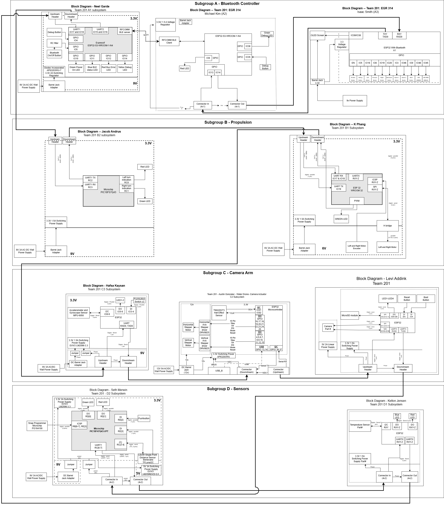

## Team Block Diagram

**Figure 1:** Block Diagram of all subsystem modules in subgroups A, B, C, D with connectors and communication chain. PDF version [*here*](files/TeamBlockDiagramUpdate.drawio.pdf)

## Sequence Diagram of Team Communication

## Message Types
| **Message Type Byte 1 (char)** | **Name** | **Description** |
| -------- | -------- |  -------- |
| A  | Set Steering Angle | Steering angle in degrees. Sent from A1 to B2 as a response to user input. Upon receiving, B2 will move the rudders to the indicated position. |
| B  | Set Throttle Percentage | Throttle percentage (can be negative for reverse thrust). Sent from A1 to B1 as a response to user input. Upon receiving, B1 will adjust the speed of the propellers to the desired percentage. |
| C  | Set Camera Angle | Camera angle in radians (absolute position). Sent from A1 to C2 as a response to user input. Upon receiving, C2 will move the camera gimbal to the indicated position.  |
| D  | Take Photo | Sent from A1 to C1 as a response to user input. Upon receiving, C1 will take a picture and save it to an SD card. |
| E  | Send Speed Data | Speed data in m/s. Sent periodically from C3 to A1. Upon receiving, A1 will update the display. |
| F  | Send Distance Data | Distance data in cm. Sent periodically from D2 to A1. Upon receiving, A1 will update the display. |
| G  | Send Temperature Data | Temperature data in cm. Sent periodically from D1 to A1. Upon receiving, A1 will update the display. |
| H  | Stabilize Arm | Current camera gimbal absolute position in radians. Sent periodically from C3 to C2. Used for gimbal stabilization. |
| J  | Rollcall | Debugging broadcast message triggered by pushing the 'debug' button on any subsystems configured to do so. Not all systems are expected to be able to trigger rollcall, but all systems must respond to it. Lights up LEDs for a set interval on every subsystem that recieves it. |

## Message Type Data Structure

Message Type A - Set Steering Angle

||**Byte 1** |**Byte 2**|**Byte 3**|**Byte 4**|
| :-------: | :-------: | :-------: | :-------: | :-------: |
| Variable Name | Sender_ID | Reciever_ID | Message_Type | Angle |
| Variable Type | char | char | char | uint8_t |
| Min Value | A | E | A | 0 |
| Max Value | A | E | A | 255|
| Example | A | E | A | 125 | 

Message Type B - Set Throttle Percentage:

||**Byte 1** |**Byte 2**|**Byte 3**|**Byte 4**|
| :-------: | :-------: | :-------: | :-------: | :-------: |
| Variable Name | Sender_ID | Reciever_ID | Message_Type | Throttle |
| Variable Type | char | char | char | uint8_t |
| Min Value | A | D | B | 0 |
| Max Value | A | D | B | 255 |
| Example | A | D | B | 125 | 

Message Type C - Set Camera Angle:

||**Byte 1** |**Byte 2**|**Byte 3**|**Byte 4**|**Byte 5**|
| :-------: | :-------: | :-------: | :-------: | :-------: | :-------: |
| Variable Name | Sender_ID | Reciever_ID | Message_Type | Yaw | Pitch |
| Variable Type | char | char | char | int8_t | int8_t |
| Min Value | A | G | C | -128 | -128 |
| Max Value | A | G | C | 127 | 127 |
| Example | A | G | C | 125 | 90 |

Message Type D - Take Photo:

||**Byte 1** |**Byte 2**|**Byte 3**|
| :-------: | :-------: | :-------: | :-------: |
| Variable Name | Sender_ID | Reciever_ID | Message_Type |
| Variable Type | char | char | char |
| Min Value | A | F | D |
| Max Value | A | F | D |
| Example | A | F | D |

Message Type E - Send Speed Data:

||**Byte 1** |**Byte 2**|**Byte 3**|**Byte 4**|
| :-------: | :-------: | :-------: | :-------: | :-------: |
| Variable Name | Sender_ID | Reciever_ID | Message_Type | Speed |
| Variable Type | char | char | char | int8_t |
| Min Value | H | A | E | -128 |
| Max Value | H | A | E | 127 |
| Example | H | A | E | -3 | 

Message Type F - Send Distance Data:

||**Byte 1** |**Byte 2**|**Byte 3**|**Byte 4**|**Byte 5**|**Byte 6**|
| :-------: | :-------: | :-------: | :-------: | :-------: | :-------: | :-------: |
| Variable Name | Sender_ID | Reciever_ID | Message_Type | Distance 1 | Distance 2 | Distance 3 |
| Variable Type | char | char | char | char | char | char |
| Min Value | J | A | F | '0' | '0' | '0' |
| Max Value | J | A | F | '9' | '9' | '9' |
| Example | J | A | F | '1' | '8' | '5' |

Message Type G - Send Temperature Data:

||**Byte 1** |**Byte 2**|**Byte 3**|**Byte 4**|
| :-------: | :-------: | :-------: | :-------: | :-------: |
| Variable Name | Sender_ID | Reciever_ID | Message_Type | Temperature |
| Variable Type | char | char | char | uint8_t |
| Min Value | I | A | G | 0 |
| Max Value | I | A | G | 255 |
| Example | I | A | G | 125 | 

Message Type H - Stabilize Arm:

||**Byte 1** |**Byte 2**|**Byte 3**|**Byte 4**|**Byte 5**|
| :-------: | :-------: | :-------: | :-------: | :-------: | :-------: |
| Variable Name | Sender_ID | Reciever_ID | Message_Type | Yaw | Pitch |
| Variable Type | char | char | char | int8_t | int8_t |
| Min Value | H | G | H | -128 | -128 |
| Max Value | H | G | H | 127 | 127 |
| Example | H | G | H | 125 | -90 |

Message Type L - Rolecall:

||**Byte 1** |**Byte 2**|**Byte 3**|
| :-------: | :-------: | :-------: | :-------: |
| Variable Name | Sender_ID | Reciever_ID | Message_Type |
| Variable Type | char | char | char |
| Min Value | A | X | J |
| Max Value | J | X | J |
| Example | A | X | J |

## Message Structure

| **Message Type** | **Message ID Type: char** | **Isaac: HMI, ID: A** | **Michael: Bluetooth (Remote, Client), ID: B** | **Neel: Bluetooth (Boat, Server), ID: C** | **Jacob: Motor (Rudder), ID: D** | **K: Motor (Propulsion), ID: E** | **Hafsa: Sensor (Gyro/Accel), ID: H** | **Austin: Motor (Arm), ID: G** |  **Levi: Camera, ID: F** |  **Seth: Sensor (Distance), ID: I** | **Kelton: Sensor (Temp), ID: J** |
| :-------: | :-------: | :-------: | :-------: | :-------: | :-------: | :-------: | :-------: | :-------: | :-------: | :-------: | :-------: |
| Set Steering Angle | A | S (left) | R (sends through bluetooth) | - | R (turns rudder) | - | - | - | - | - | - |
| Set Throttle Percentage | B | S (25%) | R (sends through bluetooth) | - | - | R (runs motors) | - | - | - | - | - |
| Set Camera Angle | C | S (up) | R (sends through bluetooth) | - | - | - | - | R (moves arm) | - | - | - |
| Take Photo | D | S (button pressed) | R (sends through bluetooth) | - | - | - | - | - | R (takes and saves picture) | - | - |
| Send Speed Data | E | R (displayed on HMI) | - | R (sends through bluetooth) | - | - | S (sends data periodically) | - | - | - | - |
| Send Distance Data | F | R (displayed on HMI) | - | R (sends through bluetooth) | - | - | - | - | - | S (sends data periodically) | - |
| Send Temperature Data | G | R (displayed on HMI) | - | R (sends through bluetooth) | - | - | - | - | - | - | S (sends data periodically) |
| Stabilize Arm | H | - | - | - | - | - | S (sends data periodically) | R (adjusts camera angle) | - | - | - |
| Bluetooth Relay | I | - | S (sends through Bluetooth) R (recieves and decodes from Bluetooth) | S (sends through Bluetooth) R (recieves and decodes from Bluetooth) | - | - | - | - | - | - | - |
| Rolecall | J | S (debug pushbutton pressed) | R (agknowledge and pass along rolecall) |  R (agknowledge and pass along rolecall) |  R (agknowledge and pass along rolecall) |  R (agknowledge and pass along rolecall) |  R (agknowledge and pass along rolecall) |  R (agknowledge and pass along rolecall) |  R (agknowledge and pass along rolecall) |  R (agknowledge and pass along rolecall) |  R (agknowledge and pass along rolecall) |

| **Item** | **Meaning** |
| :-------: | :-------: |
| S | Sends the message |
| R | Receives & does something with the message |
| - | Does nothing or passes along |

## Controller GATT service attributes

To accommodate wireless remote control, a custom BLE GATT service will be defined. In accordance with the BLE standard, custom services use a 16-byte UUID. The UUID for our controller service is 8bbd8ff7-3d84-4e81-9d46-70b6cb79e76a. The convention 'upstream' is used to refer to the wireless controller/human operator, and 'downstream' refers to the boat. Our service has the following characteristics: 

Upstream Message (5699aead-41fc-4705-9c65-7c84d8bc04c): 
This characteristic contains messages intended to be sent upstream (to the controller) from the boat. Any message of arbitrary length addressed to subsystems A1 or A2 will be written to this characteristic by A3, provided it is of a valid format. A2 will relay any messages addressed to A1 when notified of an update.

|**Read**|**Write**|**Notify**|**Capture**|
| :----: | :-----: | :------: | :-------: |
| True   | False   | True     | False     |

Downstream Message (a037a1df-ccaf-480c-b7a4-6526a6848887): 
This characteristic contains messages intended to be sent downstream (to the boat) from the controller. Any valid message will be written to this characteristic by subsystem A2 and relayed to the rest of the boat by A3 when notified of an update.

|**Read**|**Write**|**Notify**|**Capture**|
| :----: | :-----: | :------: | :-------: |
| True   | True    | True     | True      |

Rollcall (d9cba376-e9c9-4db7-a6f2-4c6783c1dade): 
To remove the requirement for parsing relayed messages from the previous two characteristics, a dedicated rollcall characteristic will be used. This can be written by either A2 or A3 to inform the other of a rollcall. Both systems will perform their rollcall functionality and proceed to relay the message upstream or downstream as needed, depending on the sender.

|**Read**|**Write**|**Notify**|**Capture**|
| :----: | :-----: | :------: | :-------: |
| True   | True    | True     | True      |

## Functionality & Decision-Making Process

The functionality of the proposed communication sequence is able to satisfy the user needs and product requirements by allowing for a modular product that also is able to send and receive messages quickly. To do this, we ordered the modules in a way that would be easy to physically connect and would have the least "travel time" for the messages from the HMI sent to the peripherials through bluetooth. For example, the HMI message to the propulsion module in the diagram is prioritized, so it is put near the front of the communcation chain. The sensor messages, on the other hand, were positioned where they would most easily be able to send continious data. For example, the Gyroscope module is positioned directly upstream of the Camera Arm so it can quickly send the stabilization data, but is also near the end of the chain so it can send the accelerometer information to HMI.

In order to better facilitate this functionality, the team decided to eliminate most delays within our respective codes by implementing timers for our functions. We also formatted data sent between modules as packages that contain as few bytes as possible which will be read and acted upon, sent downstream without reading, or trashed depending on the content and who the message is addressed to. This system overall allows for UART communication with minimal delays and errors.

Here is a list of our five biggest changes to the team's software design since we created the software proposal:

1. Changed message type from numbers to characters
2. Changed baud rate from 11520 to 9600
3. Changed bluetooth communication from serial emultation (bluetooth classic) to GATT (bluetooth low energy)
4. Changed from having a set of broadcast errors to a single rollcall
5. Integrated heartbeat into the GATT protocol for bluetooth
