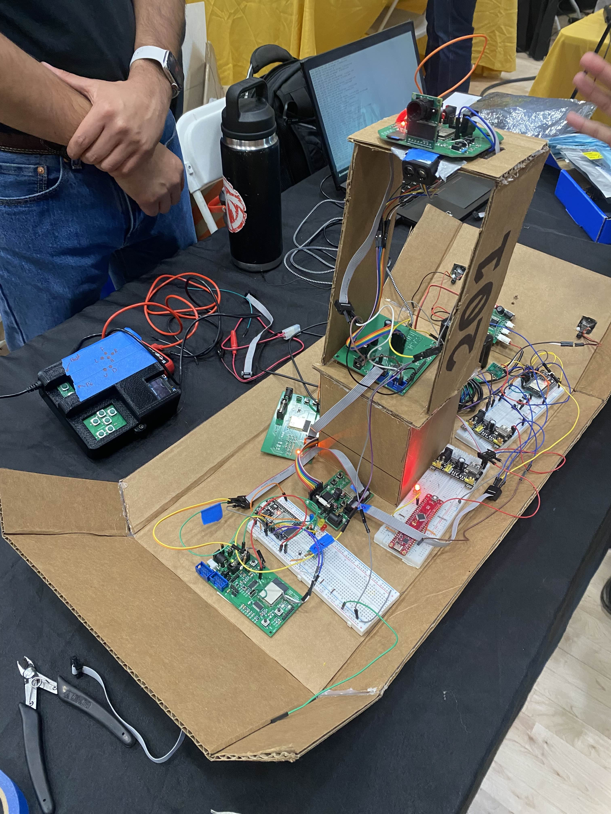

 The Duck  
Team 201  
**Submission: May 4, 2026** 
Spring - 2026 
Arizona State University 
**EGR 314** 
Kevin Nichols 

## Team Introduction
Team 201 is a 10-person group of ASU engineering students tasked with conceptualizing, designing, and building an exploration device for the course EGR 314. For this project, the team has developed prototype drone boat which gathers sensor data and takes images of its surroundings while being remote controlled. The building of the drone was split into parts, where the 10 modules developed by each individual was categorized into the subsections A, B, C, and D. Subsystem A is Wifi and Human Interface, Subsystem B takes care of the Movement and Propulsion, Subsystem C is the Camera and Positioning arm, and Subsystem D is Environmental Sensing. As you navigate through the website, you will see how each subsystem was developed and works together to make the final design.

## Concept Design
Our team's concept design process and selected design can be found on [this page of our website](https://egr314-s-2026-201.github.io/02-Concept-Design/Design/#in-a-basic-paragraph-what-is-the-goal-for-our-exploration-device).

## Team Members Datasheet links

| **Team Member**        | **Individual Datasheet Links**                                           |
| ---------------------- | ------------------------------------------------------------------------ |
| Levi Addink            | [Levi-Addink.github](https://blobiathan.github.io/)                      |
| K Phang                | [K-phang.github](https://K-Phang.github.io/)                             |
| Kelton Jensen          | [Kelton-Jensen.github](https://kjensen37.github.io/)                     |
| Neel Garde             | [Neel-Garde.github](https://neelgarde.github.io/NeelGarde/)              |
| Austin Gonzalez        | [Austin-Gonzalez.github](https://austingonzalez-egr304.github.io/AustinGonzalez-EGR314.github.io/)       |
| Seth Merwin            | [Seth-Merwin.github](https://samerwin1.github.io/Merwin_EGR314_S26/)     |
| Isaac Smith            | [Isrysm52.github](https://isrysm52.github.io/EGR314_isrysm52.github.io/) |
| Jacob Andrus           | [Jacob-Andrus.github](https://jandrus4.github.io/jandrus4/)              |
| Michael Kim            | [mjkim21.github](https://mjkim21-dev.github.io/mjkim21.github.io/)       |
| Hafsa Kaysan           | [hfsksn.github](https://hfsksn.github.io/)                               |
